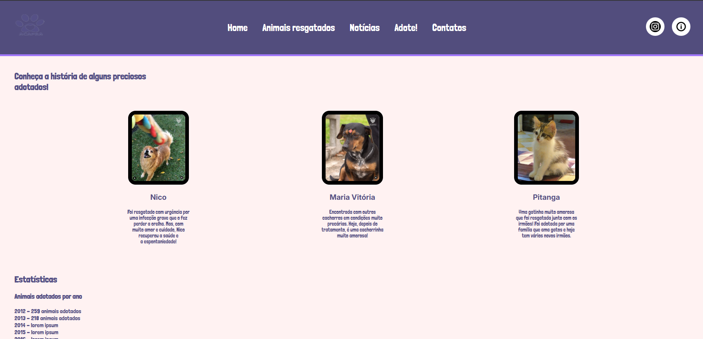
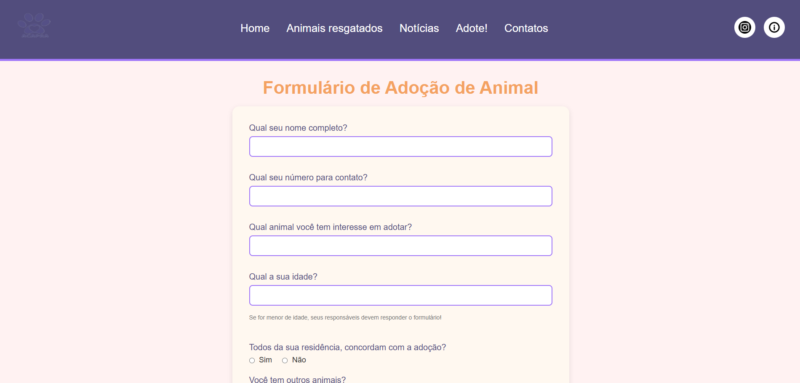

# Aplicação Web
<table>
<tr>
<td>
  Esse website trata-se um projeto realizado na semana de curricularização do curso de Sistemas de Informação da UNIFEBE. Onde os alunos foram encarregados de desenvolverem um aplicação web com o intuito de promover a conscientização e adoção de animais da instituição ACAPRA. 
</td>
</tr>
</table>

## GitHub Pages
Você pode conferir o GitHub Pages acessando esse link :  https://sarahfrainer.github.io/projeto/

## Site

### Landing Page
Dividida em 4 seções, a página inicia com a seção principal apresentando um dos animais da ACAPRA com um botão chamativo "Quero adotar" onde o usuário é levado a lista de animais disponíveis para adoção. Seguindo temos a seção de "Conheça a ACAPRA" onde o usuário terá acesso a história, contato e informações importantes da instituição. Finalizando na seção 3 é apresentado os animais disponíveis para a adoção, assim como informações importantes dos mesmos, com um botão de carregar a página e aumentar a lista de animais disponíveis

### Animais Resgatados
Página dedicada a contar as histórias dos animais que foram adotados através da instituição ACAPRA, seguidos por estátiscas de adoção e acumúlo de dívidas. 

### Nóticias
Página de nóticias focada em divulgar campanhas de arrecadação, histórias, loja virtual e qualquer outra vinculada a instituição.

## Adote
Página onde o usuário é levado a preencher um formulário com seus dados e os dados do animal que tem interesse em adotar. Caso o usuário na Landing Page clique sobre o botão adotar na seção 3, ele será levado para a página Adote.

## Contato
Página dedicada a informações de contato da instituição.

## Como contribuir

### Desenvolvimento
**Quer ajudar o projeto? Ótimo!**

Para corrigir um bug ou melhorar algum aspecto existente, siga os passos abaixo:

- Faça um fork do repositório

- Crie uma nova branch (git checkout -b melhorar-recurso)

- Faça as alterações necessárias nos arquivos

- Adicione as alterações para refletir o que foi modificado (git add .)

- Faça o commit das alterações (git commit -am 'Melhora o recurso X')

- Faça o push para a branch (git push origin melhorar-recurso)

Crie um Pull Request

### Bug / Feature Request

### Relatando bugs ou sugerindo novas funcionalidades

1. **Encontrou um bug?**
     * Vá até o repositório do projeto no GitHub.
     * Clique na aba **Issues**.
     * Clique em **New Issue**.
     * Descreva o problema com o maior número de detalhes possíveis, incluindo **o que você esperava** e **o resultado que obteve**.

2. **Quer sugerir uma nova função?**
     * Vá para a aba **Issues**.
     * Clique em **New Issue**.
     * Explique a funcionalidade desejada e inclua **o que você esperava e o resultados que encontrou**.

## Tecnologias usadas

| HTML | CSS | JS |
|------|-----|----|
|  |  |  |

## To-do
- CSS Formulário
- NAV Animais Resgatados

## Time

<table border="0" style="border-collapse: collapse;">
  <tr>
    <td align="center">
      
       
      <a href="https://github.com/sarahfrainer">Sarah</a>
    </td>
    <td align="center">
      
       
      <a href="https://github.com/JeanReinaldo/">Jean Reinaldo</a>
    </td>
    <td align="center">
      
       
      <a href="https://github.com/gui-bt/">Guilherme</a>
    </td>
    <td align="center">
      
       
      <a href="https://github.com/FelipeIBernardino/">Felipe</a>
    </td>
    <td align="center">
      
       
      <a href="https://github.com/lucasviveiross/">Lucas</a>
    </td>
  </tr>
</table>

## [License](https://opensource.org/license/mit)

MIT © 

